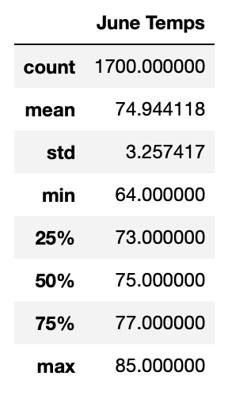
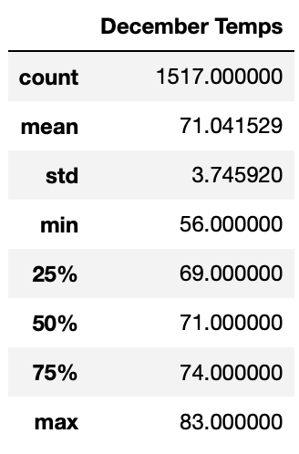
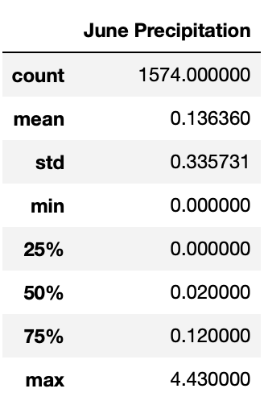
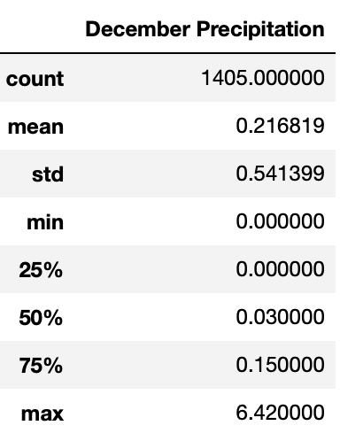
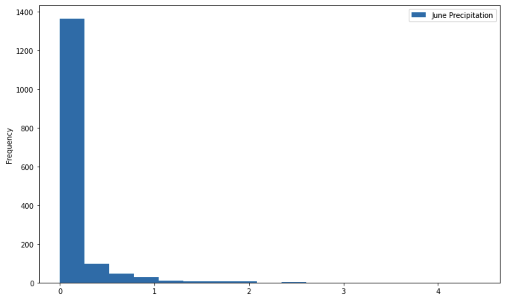
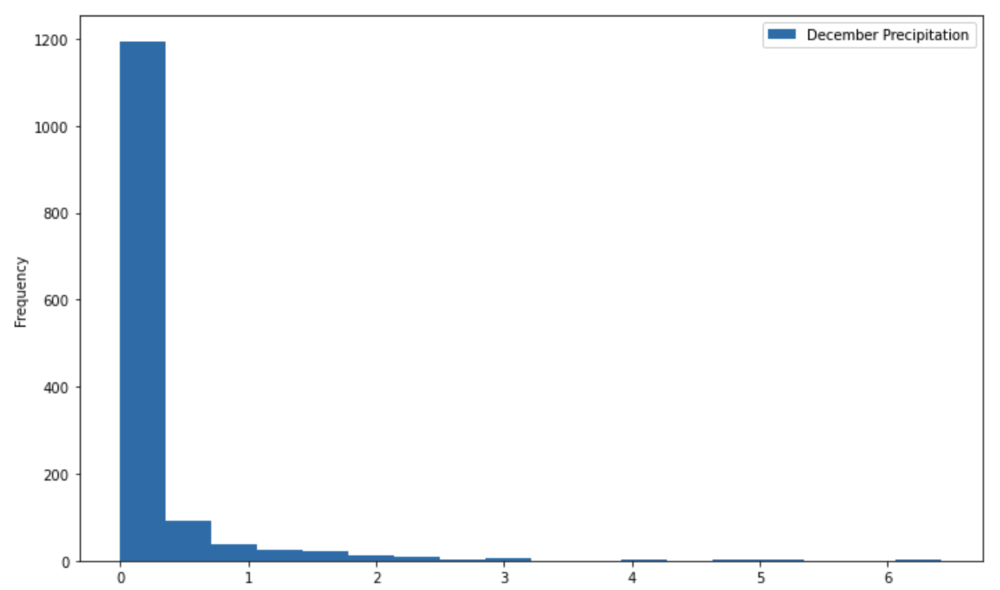

# Surfs_up

## Overview of Project

In this project, we are willing to invest our savings in opening a Surf and Ice Cream shop in Oahu, Hawaii. After putting together a strong business plan we reach out to an investor for this matter. However, the investor wants to learn more about the weather condition in Oahu prior to making a commitment in building the shop as a result he requires us to perform some analytics on the weather by providing us with the dataset he has on the island.

### Purpose 

The purpose of this project is to provide the investor with additional analysis about the temperature trends specifically for the months of June and December in Oahu, in order to determine if the Surf and Ice Cream shop business is going to be sustainable year-round or not. As a result SQLAlchemy has been used as a query tool for SQLite to perform the required queries for running the data in addition to Python, Pandas functions and methods.

## Results

In this section of the project Python, Pandas functions and methods as well as SQLAlchemy was used for determining the summary statistics of the temperatures for the months of June and December by retrieving and filtering the required data from the Measurement table in the [hawaii.sqlite](hawaii.sqlite) database.

### Summary Statistics for June and December Temperatures

In this portion of the project, the date column of the Measurement table in the [hawaii.sqlite](hawaii.sqlite) database was filtered for retrieving all the temperatures for the month of June and December. The temperatures were then converted to a list and a DataFrame was created from the lists. As a result of this,  summary statistics were generated from the two DataFrames using the **describe()** function for calculating the mean, minimum, maximum, standard deviation and percentiles of  June and December temperatures.

Figure below illustrates the summary statistics of temperatures for the month of June DataFrame.

Figure below demonstrates the summary statistics for the December temperatures DataFrame.

The results that can be observed from the summary statistics for the months of June and December are as follows:

- Months of June and December had an average temperatures of **75°F** and **71°F** respectively. This indicates that the daily mean temperatures for each day of the month of June was slightly higher than December.

- Month of June had a low temperature of **64°F** and high temperature of **85°F**. Whereas December had a low and a high temperatures of **56°F** and **83°F** respectively. Thus, indicating that June was slightly warmer than December.

- Looking at the **75th** percentiles of **77°F** and **74°F** in months of June and December respectively it is evident that both of these months had relatively warm temperatures with June being slightly warmer than December.

- June and December had a roughly similar standard deviations of **3.26** and **3.75** respectively. Since the standard deviation for temperatures of both the months were roughly low, this indicates that the temperature did not vary much in both of these months.

## Summary

After performing the required analysis of the temperature trends for the months of June and December in Oahu, Hawaii. It was determined that the Surf and Ice Cream shop business seems to be sustainable year-round and it would be a great idea to build the shop in Oahu since both of these months had relatively warm temperatures with few variations based on  their **75th** percentiles and their relatively low standard deviations.  However, since weather has other attributes such as precipitation, it is a good idea to take this attribute into consideration as well to ensure that our data supports opening a Surf and Ice Cream shop completely because there is still a chance that this location might have a rainy weather despite its warm temperature which is another important factor to be taken into consideration for opening a Surf and Ice Cream shop. 

### Summary Statistics for June and December Precipitation

In addition to temperature data, two additional queries were performed for retrieving the precipitation data for the months of June and December for determining if Oahu has a rainy weather or not. The precipitation data from the Measurement table for the months of June and December were retrieved using the queries performed. The retrieved results were then converted to pandas DataFrames and their summary statistics were generated as shown in the figures below.

*Summary statistics of precipitation in June:*

*Summary statistics of precipitation in December:*

As it is depicted in the two figures shown above, June had an average precipitation of **0.14 inches** while December had an average precipitation of **0.22 inches**. This indicates that Oahu does not experience heavy rainfalls which is a positive point in addition to its warm weather for building a Surf and Ice Cream shop. Furthermore, a histogram was plotted using the queries and the DataFrames created for visualizing the frequency of precipitation observation in June and December as demonstrated in the figures below.

*Precipitation observation in June:*

*Precipitation observation in December:*

As it can be seen in the histograms above, the vast majority of the precipitation observations for the month of June is approximately between 0 to 0.5 and between 0 to 0.75 for December. This further concludes that these two months similarly experienced moderate to no rain fall. Hence, the achieved results clearly supports opening a Surf and Ice Cream shop as this business seems to be sustainable year-round.

